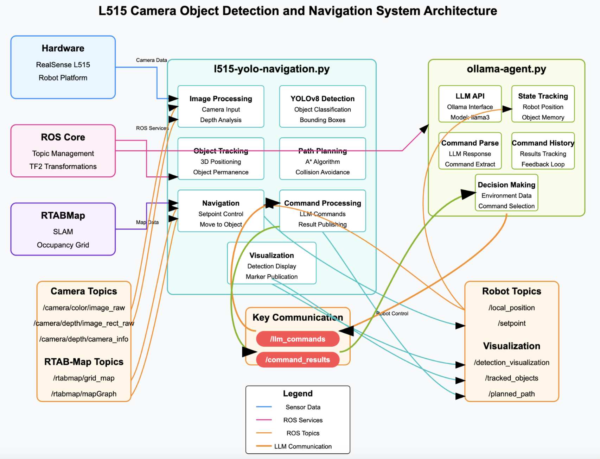
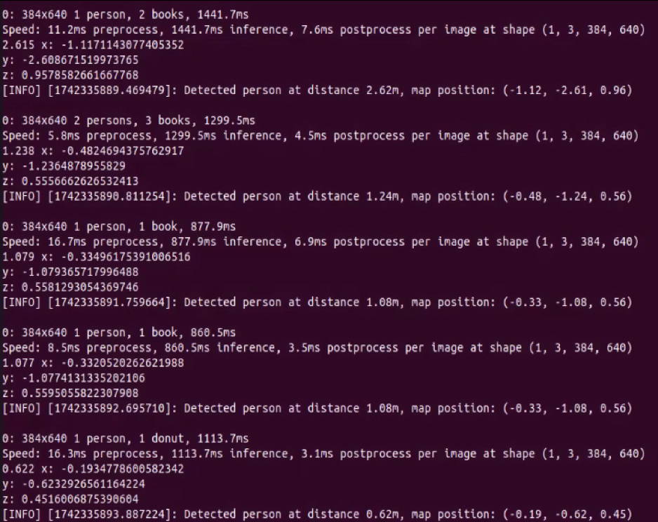
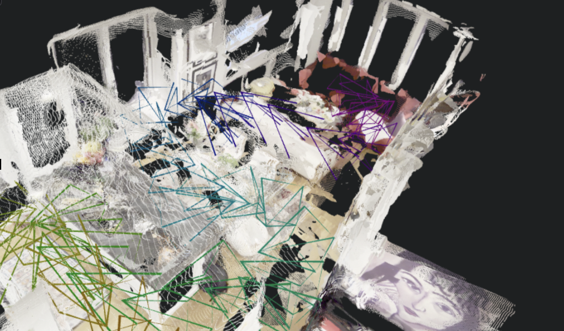

# PerceptiveLLM
Proposing a machine learning pipeline to inform a robot-controlling LLM of of features of importance in its surroundings using the Intel RealSense L515 LiDAR Camera

<details open="open">
  <summary>Table of Contents</summary>
  <ol>
    <li>
      <a href="#prerequisites">Prerequisites</a>
      <ul>
        <li>
          <a href="#install">Install</a>
          <ul>
            <li><a href="#system-requirements">System Requirements</a></li>
            <li><a href="#usage">Usage</a></li>
          </ul>
        </li>
      </ul>
    </li>
    <li>
      <a href="#objective">Objective</a>
      <ul>
        <li><a href="#plan-of-attack">Plan of Attack</a></li>
      </ul>
      <ul>
        <li><a href="#new-input-options">New Input Options</a></li>
      </ul>
    </li>
    <li>
      <a href="#results">Results</a>
      <ul>
        <li><a href="#preface">Preface</a></li>
      </ul>
      <ul>
        <li><a href="#human-tracking">Human Tracking</a></li>
      </ul>
    </li>
    <li><a href="#moving-forwards">Moving Forwards</a></li>
  </ol>
</details>

# Prerequisites

This computer vision pipeline requires a large number of dependencies due to the fact that multiple components are being orchestrated together to produce the output we seek, including YOLO(v8m), depth camera processing, RTABMap-ROS (for navigation and mapping), and optional Llama3 integration.

## Install 

To install this library one can use pip on UNIX systems:

```bash
# Install ROS dependencies (replace <distro> with your ROS distribution, I used noetic with only marginal migraines)
sudo apt-get update
sudo apt-get install -y ros-<distro>-cv-bridge
sudo apt-get install -y ros-<distro>-message-filters
sudo apt-get install -y ros-<distro>-tf2-ros
sudo apt-get install -y ros-<distro>-geometry-msgs
sudo apt-get install -y ros-<distro>-sensor-msgs
sudo apt-get install -y ros-<distro>-visualization-msgs
sudo apt-get install -y ros-<distro>-nav-msgs
sudo apt-get install -y ros-<distro>-rtabmap-ros

# Install Python dependencies
pip install --user -U ultralytics
pip install --user -U opencv-python
pip install --user -U torch torchvision
pip install --user -U numpy
pip install --user -U matplotlib
pip install --user -U requests
```
For Ollama integration (optional):
```bash
# Install and run Ollama
ollama serve
ollama pull llama3
```

### System Requirements

- Python 3.6+
- ROS installation (Noetic/Melodic)
- GPU recommended for optimal YOLO performance
- Intel RealSense L515 LiDAR Camera
- RTABMap for SLAM capabilities

###  Usage

After installing all dependencies, source your ROS workspace. These scripts are ROS nodes that can be run with rosrun:

```bash
source /opt/ros/<distro>/setup.bash
source ~/catkin_ws/devel/setup.bash

# First, create a ROS package if you haven't already:
cd ~/catkin_ws/src
catkin_create_pkg robot_vision rospy std_msgs sensor_msgs cv_bridge
cp yolo-ollama-pipeline.py ~/catkin_ws/src/robot_vision/nodes/
cp l515-yolo-navigation.py ~/catkin_ws/src/robot_vision/nodes/
chmod +x ~/catkin_ws/src/robot_vision/nodes/*.py

# Build the workspace
cd ~/catkin_ws && catkin_make

# Run the scripts
rosrun robot_vision yolo-ollama-pipeline.py
rosrun robot_vision l515-yolo-navigation.py
```
## Objective
Can multimodal sensory input be used to prevent jailbreaking of LLM-controlled robots during various navigation tasks? And to answer this question I made a number of design deicisions which in my view at the time would allow for maximal information extraction with minal overall computational load given the platform this pipeline was design for is limited in computational power for IoT requirements. 
 <br />
  <br />
More specifically, these included designing a way to manipulate multimodal sensor data in a way which can be understood by a LLM (llama3), choosing to go for JSON-formatted “observations” sent over custom ROS topics as a means of communication along the pipeline, the delegation of a number of perception and navigation tasks to reduce computational load and allow for real-time locomotion, YOLOv8m for object detection, the means of injecting L515 Depth Data, and the use of RTABMAP not just for 3D-point projection but also the generation of a 2D occupancy map to implement A* path planning.

### Plan of Attack
This robotic perception and navigation system combines computer vision, depth sensing, and language models to create an intelligent agent capable of understanding and interacting with its environment. The pipeline begins with real-time camera data acquisition, where synchronized RGB and depth images are captured and processed using YOLOv8 for object detection. The detected objects are then mapped to 3D coordinates by correlating bounding box centers with depth values, creating a spatial understanding of the environment that includes object class, confidence, position, and distance.
 <br />
  <br />
The system architecture features two distinct operational modes. The first, embodied in yolo-ollama-pipeline.py, integrates with a Large Language Model (Llama3) that acts as a high-level decision-making agent. This LLM continuously receives environmental context—including robot position, detected objects, and their spatial relationships—and issues commands like object tracking, movement directives, and scene analysis. The second mode, implemented in l515-yolo-navigation.py, focuses on autonomous navigation using RTABMap for SLAM capabilities. This version maintains a persistent map of the environment, tracks objects between frames, performs path planning using A* algorithms on occupancy grids, and executes complex navigation tasks such as object approach, area exploration, and environmental scanning.
 <br />
  <br />
The entire system operates within the ROS (Robot Operating System) framework, facilitating seamless communication between components through a publish-subscribe architecture. Camera data flows from sensor topics to processing nodes, while computed setpoints and navigation commands are published to control topics. Visualization components provide real-time feedback through OpenCV displays and RViz-compatible markers, creating a comprehensive robotic perception and control system that can be adapted for various autonomous tasks ranging from object manipulation to environment mapping and exploration.


### New Input Options
Since the development of phenomenal models including [VGGT](https://github.com/facebookresearch/vggt) and [SpatialLM](https://github.com/manycore-research/SpatialLM) the novelty of this pipeline has been marginally dimished however, they also open up new possibilities with regards to modifying the input options to the pipeline. Indeed, rather than requiring the L515 used here we could add rather an implementation of VGGT to allow for the supply of much more easily available videos as opposed to poly-sensorial streams for deployment. This is something I touch upon in a later section.
## Results
### Preface
Now to preface, given the rapid shift in direction this project underwent behind the scenes I was unable to fully test all the ramifications and features of the code, however, I am moderately confident in its complete function.
 <br />
I represent in this section below what I was able to test, which retains specifically to the Yolo object detection pipeline and the 3D object projection that is supplied by RTABMAP-ROS. I have also tested the LLM communication but do not have evidence for it, sorry!
 <br />
I did this by testing the tracking of objects in frame by having an individual moving towards and away from the L515 sensor and having the code display the relative 3D-projected position of all tracked objects by YOLO using the supplied transformations by RTABMAP.
 <br />
I hope this will suffice for now and will attempt to come back to it in future!
### Human Tracking

## Moving Forwards

* Testing all further functionality for this pipeline is absolutely necessary. During development I ran into memory issues running this code on an NVIDIA Jetson Orin Nano but that should probably be easily addressed y using a less beefy LLM than llama3, I don't believe it's fully needed, not to mention Qwen3 has since come out!
* Implementing an additional video/image frame input using something such as VGGT to then generate a point cloud as it does so below from only a 51s clip from an iPhone might make this a much more easy to deploy platform not requiring expensive LiDAR or computaionally intensive RTABMAP integration...
* 
